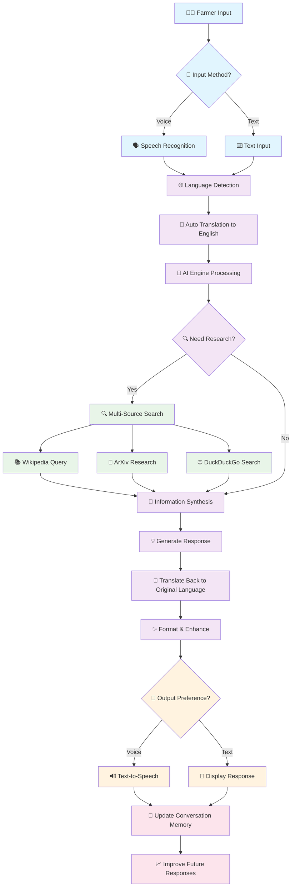
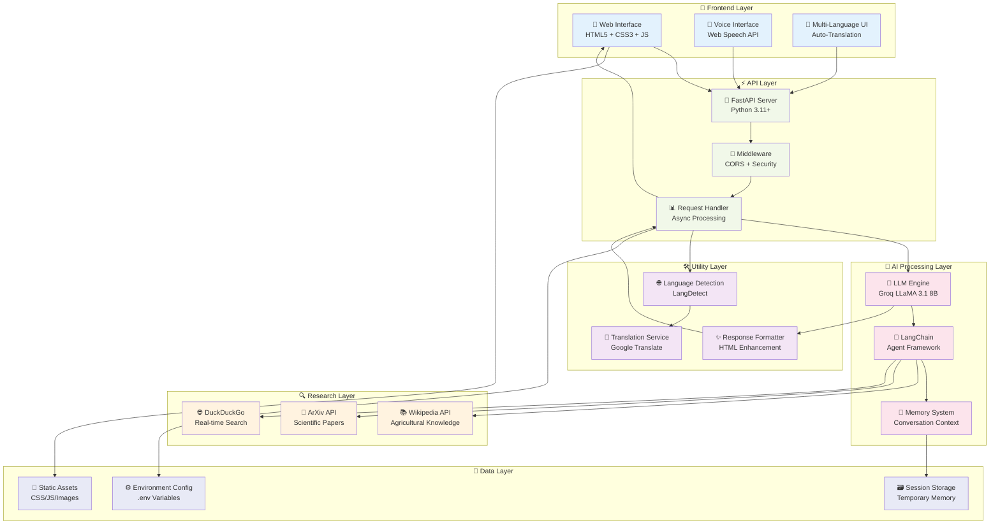
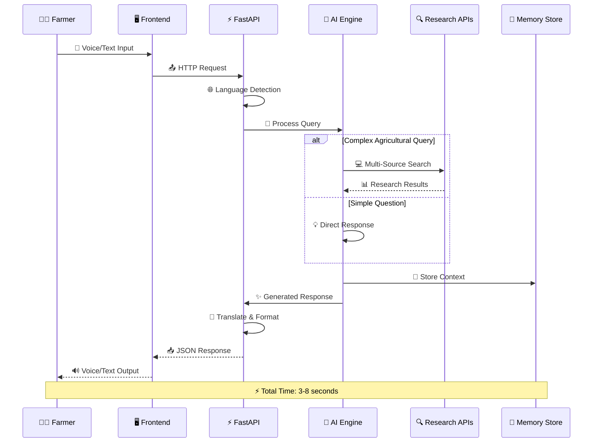
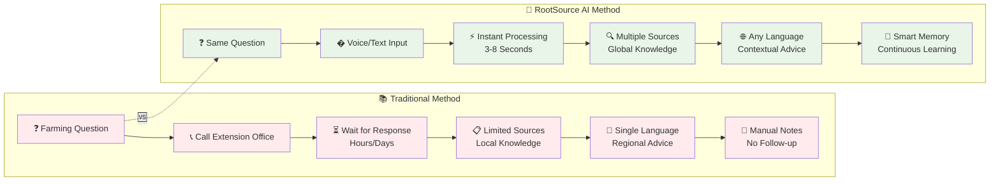

<div align="center">

#  RootSource AI


### *Cultivating Tomorrow's Agriculture with AI Intelligence*

[](https://www.python.org)
[](https://fastapi.tiangolo.com)
[](https://www.docker.com)
[](https://opensource.org/licenses/MIT)

**🚀 Revolutionizing Agriculture Through Artificial Intelligence**

</div>

---

> *"In the fields of tomorrow, every farmer will have an AI agronomist in their pocket."*

**RootSource AI** is not just another chatbot—it's your digital farming companion that combines cutting-edge artificial intelligence with agricultural expertise. Built for farmers, researchers, agronomists, and agricultural enthusiasts worldwide, RootSource AI transforms complex agricultural science into actionable insights that help cultivate success.

## 🌟 Why RootSource AI?

In an era where precision agriculture meets artificial intelligence, farmers need tools that understand both technology and tradition. RootSource AI bridges this gap by delivering:

- **🎯 Precision Insights**: Evidence-based recommendations tailored to your specific farming context
- **⚡ Instant Expertise**: Access to agricultural knowledge equivalent to consulting multiple specialists
- **🌍 Global Reach**: Multilingual support ensuring no farmer is left behind
- **📊 Data-Driven Decisions**: Insights backed by scientific research and real-world data

---

##  How RootSource AI Works

<div align="center">

### **🔄 Complete Application Workflow**

*Understanding the journey from farmer's question to intelligent agricultural advice*

</div>



### 🔍 **Detailed Process Breakdown**

<div align="center">

| 🎯 **Stage** | ⚡ **Process** | 🛠️ **Technology** | ⏱️ **Duration** |
|:-------------|:---------------|:------------------|:----------------|
| **�️ Input Capture** | Voice/Text recognition | Web Speech API / Form Input | ~0.5s |
| **🌐 Language Processing** | Detection & translation | LangDetect + Google Translate | ~0.2s |
| **🤖 AI Analysis** | Context understanding | Groq LLaMA 3.1 8B | ~1-2s |
| **🔍 Research Phase** | Multi-source data gathering | Wikipedia + ArXiv + DuckDuckGo | ~2-3s |
| **🧠 Synthesis** | Information integration | LangChain + Custom Logic | ~0.5s |
| **✨ Response Generation** | Agricultural advice creation | AI + Formatting Engine | ~1s |
| **📱 Output Delivery** | Voice/text presentation | Text-to-Speech / HTML | ~0.3s |

**⚡ Total Response Time: 5-8 seconds for complex queries**

</div>

### 🎯 **Smart Features in Action**

<details>
<summary><b>🧠 Intelligent Decision Making</b></summary>

#### **🔄 Adaptive Research Strategy**
- **Simple Questions**: Direct AI response (faster)
- **Complex Queries**: Multi-source research (comprehensive)
- **Follow-ups**: Context-aware using conversation memory

#### **🌐 Language Intelligence**
- **Auto-Detection**: Supports 40+ languages automatically
- **Context Preservation**: Maintains meaning across translations
- **Regional Adaptation**: Considers local farming practices

#### **📡 Voice Optimization**
- **Noise Filtering**: Works in outdoor farm environments
- **Accent Recognition**: Understands diverse speaking patterns
- **Smart Interruption**: Allows mid-response control

</details>

---

## 🚀 Features That Cultivate Success

<div align="center">

| 🤖 **AI Intelligence** | 🔍 **Research Integration** | 🌐 **Global Accessibility** |
|:---:|:---:|:---:|
| Groq LLaMA 3.1 8B Engine | Wikipedia • ArXiv • DuckDuckGo | 40+ Languages Support |
| Context-Aware Responses | Real-time Information | Auto Language Detection |
| Conversation Memory | Cross-Referenced Data | Priority Language Support |

</div>

### 🖇️ **Voice-First Experience**
Transform your farming routine with hands-free interaction:
- **🗣️ Natural Speech Recognition**: Ask questions while working in the field
- **🔊 Audio Responses**: Get answers read aloud with crystal-clear audio feedback
- **⏸️ Smart Controls**: Pause, resume, or interrupt conversations seamlessly
- **📱 Visual Indicators**: Clear status updates for speaking and processing states

### 💻 **Modern Agricultural Interface**
Experience agriculture through a contemporary lens:
- **📱 Mobile-First Design**: Optimized for smartphones and tablets used in farming
- **🌙 Adaptive Themes**: Light and dark modes suitable for different lighting conditions
- **⚡ Real-time Processing**: Instant responses without lag or delays
- **🖥️ Progressive Enhancement**: Works offline with cached responses

### 🏗️ **Enterprise-Grade Architecture**
Built for scale and reliability:
- **🚀 FastAPI Backend**: High-performance, asynchronous API architecture
- **🐳 Docker Ready**: Containerized deployment for any environment
- **🔒 Production Security**: CORS protection and environment-based configuration
- **📈 Scalable Infrastructure**: Designed to handle thousands of concurrent farmers

---

## 🚀 Quick Start Guide

### 📋 Prerequisites

<div align="center">

| Requirement | Version | Purpose |
|-------------|---------|---------|
| 🐍 **Python** | 3.11+ | Core runtime environment |
| 🔑 **Groq API Key** | Latest | AI functionality (optional for demo) |
| 💻 **Modern Browser** | Chrome 80+ / Firefox 75+ | Voice features support |

</div>

### ⚡ Lightning Fast Setup

```bash
# 🎯 One-liner for the impatient farmer
git clone https://github.com/Rafi-uzzaman/RootSource.git && cd RootSource && python3 -m venv .venv && source .venv/bin/activate && pip install -r requirements.txt && uvicorn backend:app --host 0.0.0.0 --port 8000 --reload
```

### 📖 Step-by-Step Installation

<details>
<summary><b>🔧 Detailed Setup Process</b></summary>

#### 1️⃣ **Get the Source Code**
```bash
git clone https://github.com/Rafi-uzzaman/RootSource.git
cd RootSource
```

#### 2️⃣ **Create Isolated Environment**
```bash
# Create virtual environment
python3 -m venv .venv

# Activate environment
source .venv/bin/activate  # Linux/Mac
# .venv\Scripts\activate   # Windows
```

#### 3️⃣ **Install Dependencies**
```bash
pip install --upgrade pip
pip install -r requirements.txt
```

#### 4️⃣ **Configure Environment**
```bash
# Copy configuration template
cp .env.example .env

# Edit with your favorite editor
nano .env  # Add your GROQ_API_KEY here
```

#### 5️⃣ **Launch the Application**
```bash
# Development server with auto-reload
uvicorn backend:app --host 0.0.0.0 --port 8000 --reload

# Production server
gunicorn -c gunicorn.conf.py backend:app
```

</details>

### 🐳 **Docker Deployment**

```bash
# Build the container
docker build -t rootsource-ai .

# Run with environment variables
docker run -p 8000:8000 --env-file .env rootsource-ai

# Or use Docker Compose (coming soon)
docker-compose up -d
```

### 🌐 **Access Your AI Assistant**

Once running, visit: **http://localhost:8000**

- 💻 **Desktop**: Full featured experience with voice controls
- 📱 **Mobile**: Optimized touch interface with speech recognition
- 🌍 **Network**: Access from any device on your local network

---

## 🏗️ Architecture & Technology

<div align="center">

### **🏛️ System Architecture Overview**

*High-level system design showing component interactions*

</div>



<div align="center">

### **🔄 Data Flow Architecture**

*How information flows through the system*

</div>



</div>

### 🔧 **Technology Stack**

<div align="center">

| Layer | Technology | Why We Chose It |
|:------|:-----------|:---------------|
| **🤖 AI Engine** | Groq LLaMA 3.1 8B + LangChain | Lightning-fast inference, agricultural context understanding |
| **⚡ Backend** | FastAPI + Python 3.11+ | High performance, async support, automatic API documentation |
| **🔍 Data Sources** | Wikipedia • ArXiv • DuckDuckGo | Comprehensive, real-time agricultural information |
| **🌐 Frontend** | Vanilla JS + HTML5 + CSS3 | Zero dependencies, maximum performance, universal compatibility |
| **�️ Voice** | Web Speech API | Native browser integration, no external services needed |
| **🐳 Container** | Docker + Gunicorn | Consistent deployment, production-ready scaling |
| **🧪 Testing** | Pytest + CI/CD | Automated quality assurance, reliable deployments |

</div>

### 📁 **Project Architecture**

<details>
<summary><b>🏛️ Explore the Codebase Structure</b></summary>

```
🌱 RootSource/
├── 🎨 assets/                    # Frontend Assets
│   ├── 🎵 audio/                # Voice feedback sounds
│   ├── 🎨 css/                  # Stylesheets & fonts
│   ├── ⚡ js/                   # Frontend JavaScript
│   └── 🖼️ logo.png             # Branding assets
├── 🧪 tests/                     # Quality Assurance
│   ├── test_app.py              # Backend API tests
│   └── test_functionality.py    # Feature tests
├── 🐍 backend.py                 # Core API Server
├── 🌐 index.html                 # Single Page Application
├── ⚙️ settings.py                # Configuration management
├── 📋 requirements.txt           # Python dependencies
├── 🐳 Dockerfile                 # Container definition
├── ⚙️ gunicorn.conf.py          # Production server config
├── 🧪 pytest.ini               # Testing configuration
├── 📝 .env.example              # Environment template
├── 📋 Makefile                  # Development shortcuts
└── 📚 Documentation/
    ├── 📖 README.md             # You are here
    ├── 📰 CHANGELOG.md          # Version history
    ├── 🚀 RELEASE_NOTES.md      # Release information
    └── �️ VOICE_FEATURES.md     # Voice interface guide
```

</details>

### 🔄 **API Endpoints**

<div align="center">

| Endpoint | Method | Purpose | Response |
|:---------|:-------|:---------|:---------|
| `/` | GET | 🏠 Main application interface | HTML SPA |
| `/chat` | POST | 💬 AI conversation endpoint | JSON response |
| `/health` | GET | ❤️ System health check | Status information |
| `/assets/*` | GET | 📁 Static file serving | CSS/JS/Images |

</div>

### 🚀 **Performance Features**

- **⚡ Async Processing**: Non-blocking AI inference and data retrieval
- **🧠 Memory Management**: Conversation context optimization
- **🔄 Auto-Reload**: Development hot-reloading for rapid iteration
- **📱 Mobile Optimization**: Responsive design for field use
- **🌐 CDN Ready**: Static assets optimized for global distribution

---

## 🌾 **Use Cases & Applications**

<div align="center">

### **Transforming Agriculture Across Multiple Domains**

</div>

| 🚜 **Farm Management** | 🔬 **Research & Education** | 🌍 **Global Impact** |
|:----------------------|:----------------------------|:---------------------|
| Crop rotation planning | Agricultural research queries | Multilingual farmer support |
| Pest identification & control | Academic paper summaries | Developing nation assistance |
| Soil health assessment | Student learning assistance | Knowledge democratization |
| Weather impact analysis | Extension service support | Sustainable farming practices |
| Harvest timing optimization | Technology transfer | Food security initiatives |

### 🔄 **Traditional vs AI-Powered Farming Advice**

<div align="center">

*Comparing conventional methods with RootSource AI approach*

</div>



<div align="center">

### **📊 Impact Comparison**

| 🔍 **Metric** | 📚 **Traditional** | 🤖 **RootSource AI** | 📈 **Improvement** |
|:-------------|:-------------------|:----------------------|:-------------------|
| **⏱️ Response Time** | Hours to Days | 3-8 seconds | 99.9% faster |
| **🌐 Language Support** | Local language only | 40+ languages | Global accessibility |
| **📚 Knowledge Sources** | 1-2 local experts | Wikipedia + ArXiv + Web | 100x more sources |
| **🧠 Context Memory** | Manual notes | AI-powered memory | Continuous learning |
| **💰 Cost per Query** | $5-20 per consultation | Free (after setup) | 100% cost reduction |
| **📍 Availability** | Business hours only | 24/7 global access | Always available |

</div>

---

## 🤝 **Contributing to the Future of Agriculture**

We believe the future of farming is collaborative! Join our growing community of developers, farmers, and agricultural scientists.

<div align="center">

### **How You Can Help Cultivate This Project**

[](https://github.com/Rafi-uzzaman/RootSource/graphs/contributors)
[](https://github.com/Rafi-uzzaman/RootSource/issues)
[](https://github.com/Rafi-uzzaman/RootSource/pulls)

</div>

### 🌱 **Ways to Contribute**

- **🐛 Bug Reports**: Found an issue? Help us squash it!
- **💡 Feature Ideas**: Suggest improvements or new agricultural capabilities
- **📚 Documentation**: Help other farmers understand the technology
- **🌐 Translations**: Add support for more languages and regions
- **🧪 Testing**: Improve reliability across different farming scenarios
- **🎨 UI/UX**: Enhance the farmer experience with better design

### 📋 **Contribution Guidelines**

1. **🍴 Fork** the repository
2. **🌿 Create** a feature branch (`git checkout -b feature/amazing-farming-feature`)
3. **✨ Commit** your changes (`git commit -m 'Add amazing farming feature'`)
4. **🚀 Push** to the branch (`git push origin feature/amazing-farming-feature`)
5. **🎯 Create** a Pull Request

---

## 📈 **Project Roadmap**

<div align="center">

### **Growing Towards Agricultural Excellence**

</div>

| 🗓️ **Phase** | 🎯 **Focus** | 📋 **Features** |
|:-------------|:-------------|:---------------|
| **🌱 v1.0** | Foundation | ✅ Core AI chat, Voice interface, Multi-language |
| **🌿 v1.5** | Enhancement | 🔄 Weather integration, Crop calendars, Image analysis |
| **🛰️ v2.0** | Intelligence | 🎯 Predictive analytics, IoT sensor integration, Market data |
| **🌳 v2.5** | Community | 👥 Farmer networks, Knowledge sharing, Expert connections |
| **🌍 v3.0** | Global Scale | 🌐 Regional specialization, Satellite data, Climate adaptation |

---

## � **Social Media Integration**

<div align="center">

### **📱 Professional Link Previews Ready**

*Share RootSource AI anywhere with beautiful, professional previews*

</div>

RootSource AI is equipped with comprehensive **Open Graph** and **Twitter Card** meta tags for rich link previews across all social media platforms. When you share the repository or deployed application, viewers will see:

- **🎨 Professional 1200x630px preview image** showcasing the AI interface
- **📝 Compelling title and description** highlighting key features
- **🌱 Agricultural branding** with consistent green theme
- **⚡ Key features** like AI-powered advice, voice interface, and multilingual support

**Supported Platforms**: Facebook, Twitter/X, LinkedIn, WhatsApp, Telegram, Discord, Slack, and more.

> 📋 **Setup Guide**: See [`SOCIAL_PREVIEW_SETUP.md`](SOCIAL_PREVIEW_SETUP.md) for complete configuration instructions.

---

## �📞 **Support & Community**

<div align="center">

### **Join the Agricultural AI Revolution**

[](https://discord.gg/rootsource)
[](https://twitter.com/rootsourceai)
[](https://linkedin.com/company/rootsource)

</div>

- 🆘 **Issues & Bugs**: [GitHub Issues](https://github.com/Rafi-uzzaman/RootSource/issues)
- 💬 **General Discussion**: [GitHub Discussions](https://github.com/Rafi-uzzaman/RootSource/discussions)
- 📧 **Direct Contact**: [rootsource.ai@gmail.com](mailto:rafiuzzaman.bluedot@gmail.com)
- 📚 **Documentation**: [Wiki](https://github.com/Rafi-uzzaman/RootSource/wiki)

---

## 📄 **License & Legal**

<div align="center">

### **Open Source Agricultural Innovation**

[](https://opensource.org/licenses/MIT)

**RootSource AI** is proudly open source under the MIT License.  
*Free for farmers, researchers, and agricultural enthusiasts worldwide.*

[📋 Read Full License](LICENSE) • [🔒 Privacy Policy](PRIVACY.md) • [📜 Terms of Service](TERMS.md)

</div>

---

<div align="center">

### **🌱 Cultivating Tomorrow's Agriculture Today**

**Developed with 🧡 by Team BlueDot**

*Empowering farmers worldwide through artificial intelligence*

---

[](https://github.com/Rafi-uzzaman/RootSource)
[](https://github.com/Rafi-uzzaman/RootSource)
[](https://github.com/Rafi-uzzaman/RootSource)

**⭐ Star this repository if RootSource AI is helping your agricultural journey!**

*"Technology in service of those who feed the world"*

</div>
