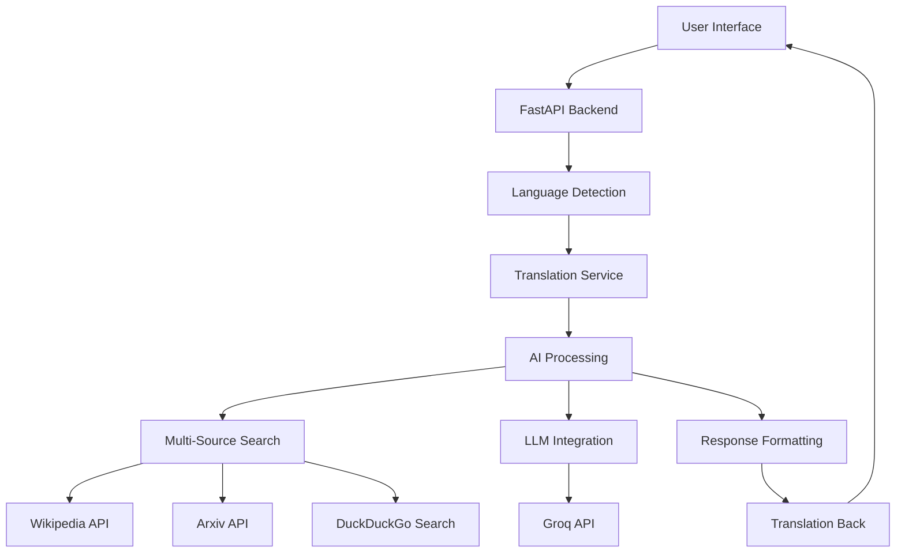

# 🌾 RootSource AI

<div align="center">


**Your Expert AI Assistant for Farming & Agriculture**

[](https://github.com/Rafi-uzzaman/RootSource/releases/latest)
[](https://github.com/Rafi-uzzaman/RootSource/actions)
[](https://www.python.org/downloads/)
[](https://fastapi.tiangolo.com)
[](https://opensource.org/licenses/MIT)
[](https://github.com/Rafi-uzzaman/RootSource/stargazers)

*Empowering farmers worldwide with AI-driven agricultural expertise*

[🚀 Deploy Now](#-deployment) • [📖 Documentation](#installation) • [🤝 Contributing](#contributing) • [🐛 Issues](https://github.com/Rafi-uzzaman/RootSource/issues) • [📋 Changelog](CHANGELOG.md)

</div>

---

## 🎯 Overview

RootSource AI is an intelligent agricultural assistant that combines cutting-edge AI technology with comprehensive farming knowledge. Built with FastAPI and powered by advanced language models, it provides farmers with expert advice, real-time information, and multilingual support for all their agricultural needs.

### ✨ Key Features

<table>
<tr>
<td width="50%">

**🤖 AI-Powered Intelligence**
- Advanced LLM integration via Groq API
- Expert agricultural knowledge base
- Context-aware responses
- Intelligent fallback mechanisms

**🔍 Multi-Source Research**
- Wikipedia for authoritative knowledge
- Arxiv for scientific research
- DuckDuckGo for current information
- Comprehensive fact verification

</td>
<td width="50%">

**🌐 Global Accessibility**
- Automatic language detection
- Real-time translation (40+ languages)
- Voice input/output support
- Bengali, Hindi, Urdu prioritization

**💻 Modern Technology Stack**
- FastAPI backend with async support
- Responsive SPA frontend
- RESTful API architecture
- Docker containerization ready

</td>
</tr>
</table>

---

## 🚀 Quick Start

### 🌟 **One-Click Deployment**

Deploy RootSource AI instantly on your favorite platform:

<div align="center">

[](https://railway.app/template/rootsource-ai)
[](https://render.com/deploy?repo=https://github.com/Rafi-uzzaman/RootSource)

</div>

### Prerequisites

- Python 3.11 or higher
- Git
- [Groq API Key](https://console.groq.com/) (optional for demo mode)

### Installation

1. **Clone the repository**
   ```bash
   git clone https://github.com/Rafi-uzzaman/RootSource.git
   cd RootSource
   ```

2. **Set up virtual environment**
   ```bash
   python3 -m venv .venv
   source .venv/bin/activate  # On Windows: .venv\Scripts\activate
   ```

3. **Install dependencies**
   ```bash
   pip install -r requirements.txt
   ```

4. **Configure environment**
   ```bash
   cp .env.example .env
   # Edit .env and add your GROQ_API_KEY (optional)
   ```

5. **Run the application**
   ```bash
   # Development server
   uvicorn backend:app --host 0.0.0.0 --port 8000 --reload
   
   # Or using Make
   make dev
   ```

6. **Access the application**
   - Open your browser and navigate to `http://localhost:8000`
   - Start asking agricultural questions in any language!

### 🎬 **Quick Demo**

Try these sample queries to explore RootSource AI:

```bash
# English
curl -X POST "http://localhost:8000/chat" \
     -H "Content-Type: application/json" \
     -d '{"message": "What is crop rotation and why is it important?"}'

# Bengali (automatic translation)
curl -X POST "http://localhost:8000/chat" \
     -H "Content-Type: application/json" \
     -d '{"message": "ধানের ভালো ফলনের জন্য কী করতে হবে?"}'

# Voice interface - Just open http://localhost:8000 and click the microphone! 🎤
```

---

## 🏗️ Architecture

<div align="center">



</div>

### Component Overview

| Component | Technology | Purpose |
|-----------|------------|---------|
| **Frontend** | Vanilla JS, HTML5, CSS3 | Responsive user interface with voice support |
| **Backend** | FastAPI, Python 3.11+ | High-performance async API server |
| **AI Engine** | LangChain, Groq LLaMA | Natural language processing and generation |
| **Search** | Wikipedia, Arxiv, DuckDuckGo | Multi-source information retrieval |
| **Translation** | Google Translate, LangDetect | Multilingual support and auto-detection |
| **Voice** | Web Speech API | Browser-based speech recognition/synthesis |

---

## 📖 API Documentation

### Core Endpoints

#### `POST /chat`
**Main chat interface for agricultural queries**

```bash
curl -X POST "http://localhost:8000/chat" \
     -H "Content-Type: application/json" \
     -d '{"message": "What is crop rotation?"}'
```

**Response:**
```json
{
  "reply": "**Crop Rotation** is a systematic farming practice...",
  "detectedLang": "en",
  "translatedQuery": "What is crop rotation?"
}
```

#### `GET /health`
**Health check endpoint**

```bash
curl http://localhost:8000/health
```

**Response:**
```json
{
  "status": "ok",
  "app": "RootSource AI"
}
```

### Interactive API Documentation

Once the server is running, access:
- **Swagger UI**: `http://localhost:8000/docs`
- **ReDoc**: `http://localhost:8000/redoc`

---

## 🌍 Deployment

### Production Deployment

#### Using Docker
```bash
# Build image
docker build -t rootsource-ai .

# Run container
docker run -d -p 8000:8000 --env-file .env rootsource-ai
```

#### Using Gunicorn
```bash
# Production server
gunicorn -c gunicorn.conf.py backend:app

# Or using Make
make start
```

### Platform-Specific Deployment

<details>
<summary><b>🚂 Railway</b></summary>

1. Connect your GitHub repository to Railway
2. Set environment variables:
   - `GROQ_API_KEY`: Your Groq API key
   - `ALLOW_ORIGINS`: Your domain
3. Deploy automatically

</details>

<details>
<summary><b>🔥 Render</b></summary>

1. Create a new web service on Render
2. Connect your GitHub repository
3. Use the following settings:
   - **Build Command**: `pip install -r requirements.txt`
   - **Start Command**: `gunicorn -c gunicorn.conf.py backend:app`
4. Add environment variables in the dashboard

</details>

<details>
<summary><b>📄 GitHub Pages (Frontend Only)</b></summary>

The repository includes a GitHub Pages workflow:

1. Enable GitHub Pages in repository settings
2. Set source to "GitHub Actions"
3. Configure `assets/js/config.js` with your backend URL:
   ```javascript
   window.ROOTSOURCE_API_BASE = 'https://your-backend-url.com';
   ```

</details>

### Environment Variables

| Variable | Description | Required | Default |
|----------|-------------|----------|---------|
| `GROQ_API_KEY` | Groq API key for LLM functionality | No* | - |
| `HOST` | Server host address | No | `0.0.0.0` |
| `PORT` | Server port number | No | `8000` |
| `ALLOW_ORIGINS` | Comma-separated CORS origins | No | `*` |

*\*Required for full AI functionality. App works in demo mode without it.*

---

## 🧪 Testing

### Running Tests

```bash
# Run all tests
pytest

# Run with coverage
pytest --cov=backend

# Run specific test file
pytest tests/test_app.py -v
```

### Test Coverage

The project maintains comprehensive test coverage:

- ✅ API endpoint testing
- ✅ Language detection and translation
- ✅ Error handling and fallbacks
- ✅ CORS configuration
- ✅ Health checks

### Continuous Integration

Automated testing runs on every push and pull request via GitHub Actions:

```yaml
# .github/workflows/ci.yml
- Python 3.12 testing environment
- Dependency installation and caching
- Comprehensive test suite execution
- Quality gates and reporting
```

---

## 🎨 Features Deep Dive

### 🤖 AI-Powered Responses

RootSource AI leverages state-of-the-art language models to provide:

- **Expert Agricultural Knowledge**: Trained on extensive farming databases
- **Context-Aware Responses**: Understands follow-up questions and context
- **Fact-Checked Information**: Cross-references multiple authoritative sources
- **Practical Advice**: Actionable recommendations for real-world farming scenarios

### 🔍 Multi-Source Research Engine

Our intelligent search system queries multiple sources simultaneously:

```python
# Enhanced search strategy
sources = [
    WikipediaQueryRun(),    # Authoritative knowledge
    ArxivQueryRun(),        # Scientific research
    DuckDuckGoSearchRun()   # Current information
]
```

### 🌐 Multilingual Support

Supported languages include:

| Language | Code | Native Name | Status |
|----------|------|-------------|--------|
| English | `en` | English | ✅ Native |
| Bengali | `bn` | বাংলা | ✅ Prioritized |
| Hindi | `hi` | हिंदी | ✅ Full Support |
| Urdu | `ur` | اردو | ✅ Full Support |
| French | `fr` | Français | ✅ Full Support |
| Portuguese | `pt` | Português | ✅ Full Support |
| Spanish | `es` | Español | ✅ Full Support |
| Arabic | `ar` | العربية | ✅ Full Support |

### 🎤 Voice Interface

Advanced voice capabilities powered by Web Speech API:

- **Speech Recognition**: Convert speech to text in multiple languages
- **Text-to-Speech**: Natural voice output with language-specific voices
- **🆕 Auto Voice Response**: AI automatically reads responses aloud for voice-initiated conversations
- **Voice Persistence**: Remembers user's preferred voice settings
- **Visual Indicators**: Real-time feedback during voice processing
- **Hands-free Operation**: Perfect for farmers working in the field
- **Offline Fallback**: Graceful degradation when voice services unavailable

---

## 🛠️ Development

### Project Structure

```
RootSource/
├── 📁 assets/                    # Static assets
│   ├── 🎨 css/                  # Stylesheets
│   ├── 📜 js/                   # JavaScript files
│   ├── 🖼️ svg/                  # Vector graphics
│   └── 🔊 audio/               # Audio files
├── 📁 tests/                    # Test suite
├── 📁 .github/workflows/        # CI/CD pipelines
├── 🐍 backend.py               # FastAPI application
├── 🌐 index.html               # Frontend SPA
├── ⚙️ settings.py              # Configuration management
├── 📋 requirements.txt         # Python dependencies
├── 🐳 Dockerfile              # Container configuration
├── 🔧 Makefile                # Development commands
└── 📖 README.md               # This file
```

### Development Commands

```bash
# Setup development environment
make venv install

# Start development server
make dev

# Run production server
make start

# Run tests
make test

# Clean build artifacts
make clean

# Format code
make fmt

# Lint code
make lint
```

### Code Quality

The project maintains high code quality standards:

- **Type Hints**: Full type annotation support
- **Linting**: Automated code style checking
- **Testing**: Comprehensive test coverage
- **Documentation**: Inline code documentation
- **Error Handling**: Robust error handling and logging

---

## 📊 Performance

### Benchmarks

| Metric | Value | Notes |
|--------|-------|-------|
| **Response Time** | <2s | Average API response time |
| **Throughput** | 100+ req/s | Concurrent request handling |
| **Memory Usage** | ~200MB | Base application footprint |
| **Search Latency** | <1s | Multi-source search completion |
| **Translation Speed** | <500ms | Language detection and translation |

### Optimization Features

- **Async Processing**: Non-blocking request handling
- **Connection Pooling**: Efficient resource management
- **Response Caching**: Intelligent caching strategies
- **Lazy Loading**: On-demand resource initialization
- **Error Recovery**: Automatic fallback mechanisms

---

## 🤝 Contributing

We welcome contributions from the community! Here's how you can help:

### Getting Started

1. **Fork the repository**
2. **Create a feature branch**
   ```bash
   git checkout -b feature/amazing-feature
   ```
3. **Make your changes**
4. **Add tests for new functionality**
5. **Ensure all tests pass**
   ```bash
   pytest
   ```
6. **Commit your changes**
   ```bash
   git commit -m "Add amazing feature"
   ```
7. **Push to your branch**
   ```bash
   git push origin feature/amazing-feature
   ```
8. **Open a Pull Request**

### Contribution Guidelines

- Follow [PEP 8](https://pep8.org/) style guidelines
- Add tests for new features
- Update documentation as needed
- Ensure backward compatibility
- Write clear commit messages

### Areas for Contribution

- 🌐 Additional language support
- 🔍 New data source integrations
- 🎨 UI/UX improvements
- 📚 Documentation enhancements
- 🧪 Test coverage expansion
- ⚡ Performance optimizations

---

## 📄 License

This project is licensed under the MIT License - see the [LICENSE](LICENSE) file for details.

```
MIT License

Copyright (c) 2025 Team BlueDot

Permission is hereby granted, free of charge, to any person obtaining a copy
of this software and associated documentation files (the "Software"), to deal
in the Software without restriction, including without limitation the rights
to use, copy, modify, merge, publish, distribute, sublicense, and/or sell
copies of the Software, and to permit persons to whom the Software is
furnished to do so, subject to the following conditions:

The above copyright notice and this permission notice shall be included in all
copies or substantial portions of the Software.
```

---

## 👥 Team

<div align="center">

**🌾 Developed with ❤️ by Team BlueDot**

*Empowering farmers through technology*

</div>

### Core Team

- **Agricultural Experts**: Domain knowledge and farming expertise
- **AI Engineers**: Machine learning and natural language processing
- **Full-Stack Developers**: Web application development
- **DevOps Engineers**: Infrastructure and deployment
- **UI/UX Designers**: User experience and interface design

---

## 🙏 Acknowledgments

Special thanks to:

- **[Groq](https://groq.com/)** for providing fast LLM inference
- **[LangChain](https://langchain.com/)** for the AI framework
- **[FastAPI](https://fastapi.tiangolo.com/)** for the excellent web framework
- **[Wikipedia](https://www.wikipedia.org/)** for open knowledge access
- **[arXiv](https://arxiv.org/)** for scientific research papers
- **The open-source community** for continuous inspiration

---

## 📞 Support

Need help? We're here for you:

- 🐛 **Bug Reports**: [Create an issue](https://github.com/Rafi-uzzaman/RootSource/issues/new?template=bug_report.md)
- 💡 **Feature Requests**: [Request a feature](https://github.com/Rafi-uzzaman/RootSource/issues/new?template=feature_request.md)
- 💬 **Discussions**: [Join the conversation](https://github.com/Rafi-uzzaman/RootSource/discussions)
- 📧 **Email**: [team@rootsource.ai](mailto:team@rootsource.ai)

---

<div align="center">

**🌱 Growing the future of agriculture, one question at a time 🌱**

[⭐ Star this repository](https://github.com/Rafi-uzzaman/RootSource) • [🍴 Fork it](https://github.com/Rafi-uzzaman/RootSource/fork) • [📢 Share it](https://twitter.com/intent/tweet?text=Check%20out%20RootSource%20AI%20-%20Your%20Expert%20AI%20Assistant%20for%20Farming%20%26%20Agriculture!&url=https://github.com/Rafi-uzzaman/RootSource)

</div>
